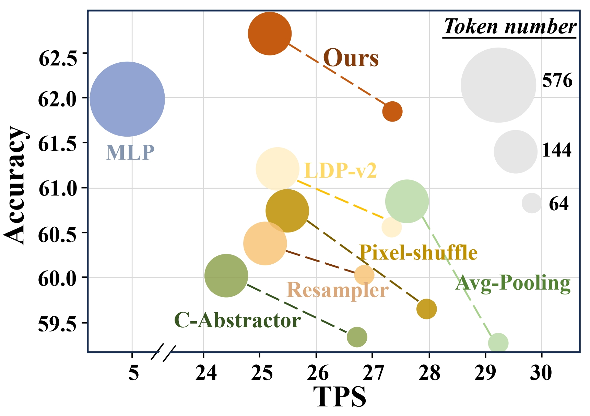
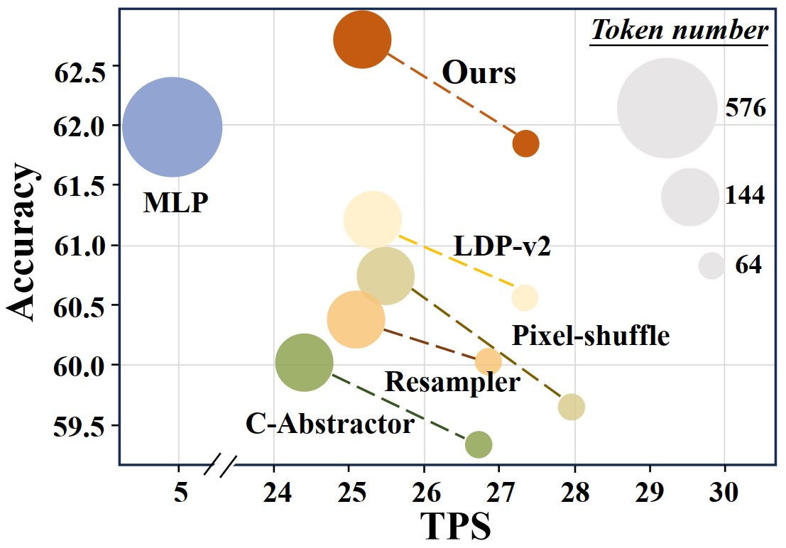
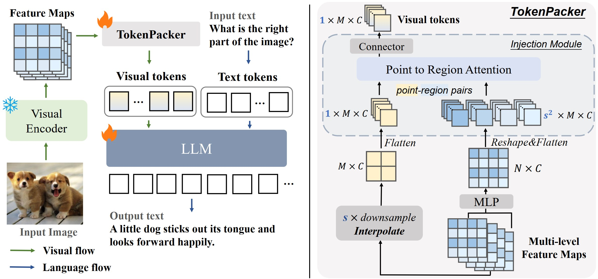
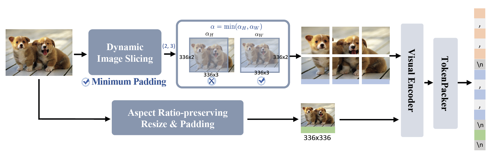
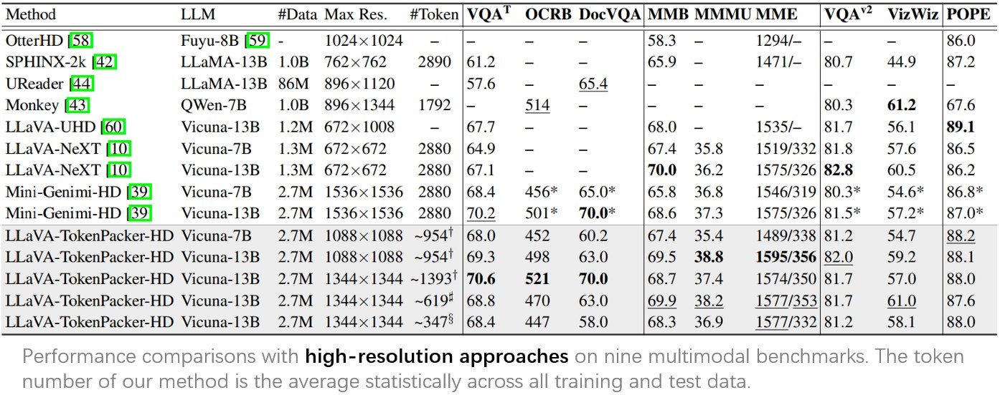
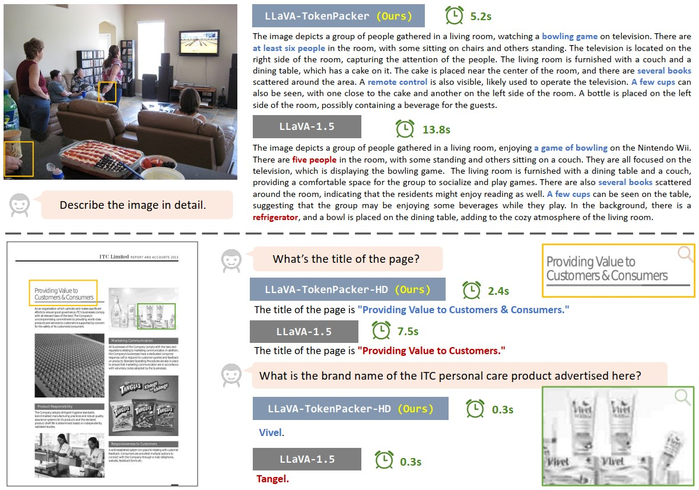
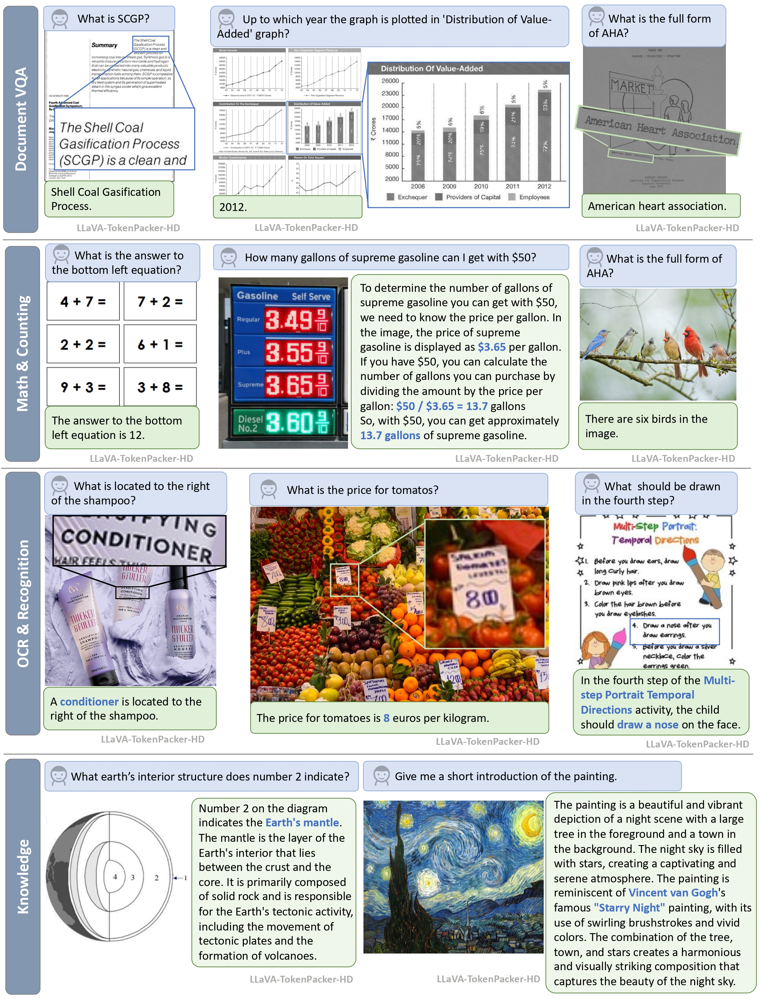

<p align="center" width="100%">

</p>


<div align=center>
<a href="" target="_blank">
    
</a>
<a href="https://arxiv.org/abs/2407.02392" target="_blank">
    
</a>
<a href="" target="_blank">
    
</a>
<a href="https://zhuanlan.zhihu.com/p/707021763" target="_blank">
    
</a>   
 </div>


---

## Comparisons with existing methods 💡
<!--  -->
<p align="center" width="100%">

</p>

## Updates 📌
- [2024/7/3] We released the [paper](https://arxiv.org/abs/2407.02392) of our TokenPacker on Arxiv.
- [2024/7/3] We released the training and inference codes. 


## What is TokenPacker 👀
TokenPacker is a novel visual projector, which adopts a `coarse-to-fine` scheme
to inject the enriched characteristics to generate the condensed visual tokens. Using TokenPacker, we can compress the
visual tokens by **75%∼89%**, while achieves comparable or even better performance
across diverse benchmarks with significantly higher efficiency.


## High-Resolution Image Understanding with TokenPacker 🔬
To support efficient `high-resolution` image understanding, we further develop an effective image
cropping method `TokenPacker-HD`.



## Install 🛠️
1. Clone this repository and navigate to TokenPacker folder
```
git clone https://github.com/CircleRadon/TokenPacker.git
cd TokenPacker
```
2. Install packages
```
conda create -n tokenpacker python=3.10 -y
conda activate tokenpacker
pip install --upgrade pip  # enable PEP 660 support
pip install -e .
```
3. Install additional packages for training cases
```
pip install -e ".[train]"
pip install flash-attn --no-build-isolation
```

## Training 🚀

### LLaVA-TokenPacker

#### Dataset
To make a fair comparison, we use the same training data as in [LLaVA-1.5](https://github.com/haotian-liu/LLaVA), i.e., [CC3M-595K](https://huggingface.co/datasets/liuhaotian/LLaVA-CC3M-Pretrain-595K) for stage 1, and  [Mix665k](https://huggingface.co/datasets/liuhaotian/LLaVA-Instruct-150K/tree/main) for stage 2.

#### Training 
- Stage1: Image-Text Alignment Pre-training
```shell
bash scripts/v1_5/pretrain.sh
```
- Stage2: Visual Instruction Tuning
```shell
bash scripts/v1_5/finetune.sh
```
Note: Using `--scale_factor` to control compression ratio, support [2,3,4]

### LLaVA-TokenPacker-HD

#### Dataset
To obtain the competitive high-resolution performance, we use 2.7M data as organized by [Mini-Gemini](https://github.com/dvlab-research/MGM#Dataset), i.e., 1.2M for stage 1 and 1.5M for stage 2.

#### Training 
- Stage1: Image-Text Alignment Pre-training
```shell
bash scripts/v1_5/pretrain_hd.sh
```
- Stage2: Visual Instruction Tuning
```shell
bash scripts/v1_5/finetune_hd.sh
```

Note: 
1. Using `--scale_factor` to control compression ratio, support [2,3,4]. 
2. Using `--patch_num` to control max patch dividing number, support [9,16,25].


## Experiments




## Visualization
We provide some visual examples.




High-resolution image understanding.



## TODO List 📝
- [x] Release the training and inference codes.
- [ ] Release all checkpoints.


## Acknowledgement 💌
- [LLaVA-v1.5](https://github.com/haotian-liu/LLaVA): the codebase we built upon.
  


## BibTeX 🖊️
```
@misc{TokenPacker,
  title={TokenPacker: Efficient Visual Projector for Multimodal LLM},
  author={Wentong Li, Yuqian Yuan, Jian Liu, Dongqi Tang, Song Wang, Jianke Zhu and Lei Zhang},
  year={2024},
  eprint={2407.02392},
  archivePrefix={arXiv},
  primaryClass={cs.CV}
}
```
